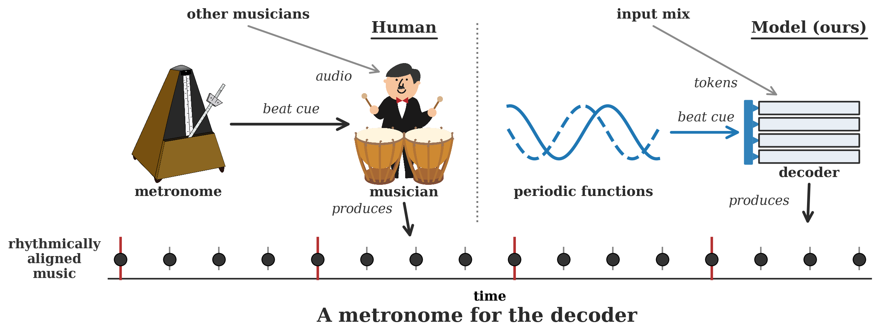
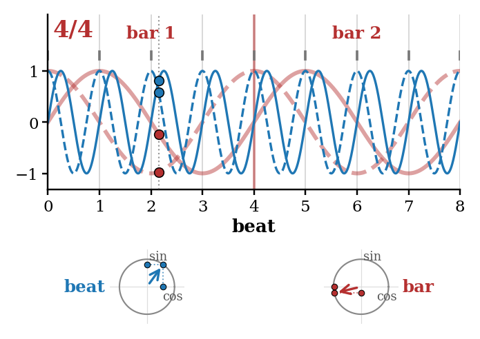

# SilentMetronome

**Beat-phase conditioning and auxiliary supervision for beat-aligned streaming music accompaniment generation.**

<p align="center">
  <a href="https://arxiv.org/abs/XXXX.XXXXX"><b>📄 Paper (arXiv)</b></a> ·
  <a href="https://kevin-bretz.github.io/projects/silentmetronome"><b>🔊 Demo page</b></a> ·
  <a href="https://huggingface.co/WhatzInTheGrass/SilentMetronome"><b>🤗 Pretrained checkpoints</b></a><br>
  <sub><i>paper, demo page, and checkpoint repository are being finalised — these links go live soon</i></sub>
</p>

SilentMetronome extends [stream-music-gen](https://github.com/lukewys/stream-music-gen) (Wu et al., 2025), a causal transformer that generates a musical accompaniment stem in real time while listening to an incoming mix. The baseline system produces musically plausible audio but drifts off the beat: under strictly causal streaming constraints its accompaniments align poorly with the pulse of the input. SilentMetronome fixes this with two lightweight, architecture-level additions — a *silent metronome* conditioning signal and a set of auxiliary prediction heads — that more than double beat alignment while also improving harmonic coherence.

<p align="center">
  
</p>

## Method

<p align="center">
  
</p>

**1. Silent-metronome (SiMe) conditioning.** From each track's beat grid we compute a per-frame beat-phase signal at the 50 Hz token rate: `[sin 2πφ_beat, cos 2πφ_beat, sin 2πφ_bar, cos 2πφ_bar]`, where `φ_beat` is the phase within the current beat and `φ_bar` the phase within the current bar, plus a time-signature embedding. This is the information a metronome click would carry — but injected silently, as a conditioning signal rather than audio. It enters the decoder through DiT-style per-layer adaptive layer-norm (gain/gate) modulation, which we found far more effective than additive input conditioning.

**2. Auxiliary prediction heads.** Small MLP heads on the decoder trunk are trained to predict, at each frame:
- the **multipitch** activation of the target stem,
- the **CQT** of the target stem,
- the target's **DAC tokens δ frames into the future** (δ ∈ {10, 25, 40}), one independent classifier per offset.

The heads are dropped at inference time, so they add zero latency. They shape the trunk representation toward pitch- and rhythm-aware features, and the future-token heads in particular recover the performance that is otherwise lost when the model must operate with little or no lookahead.

**3. Streaming latency.** Because the beat-phase signal for a chunk is known ahead of time, the per-layer modulation tensors are precomputed for the whole upcoming chunk before decoding starts and applied as elementwise scaling — the conditioning adds no cost to the serial decoding path.

## Results

Slakh2100 test set, 1024 samples, streaming with 1 s chunks (`chunk_size = 50` frames) and zero lookahead (`future_visibility = 0`):

| Model | Beat-F ↑ | COCOLA ↑ | FAD ↓ |
|---|---|---|---|
| stream-music-gen baseline | 0.184 | 54.28 | 3.64 |
| + SiMe conditioning | 0.384 | 60.01 | 4.22 |
| + SiMe + auxiliary heads | **0.436** | **60.85** | 4.28 |
| *non-causal reference (1 s lookahead)* | *0.319* | *60.98* | *3.35* |

- **Beat-F**: F-measure between beats detected ([Beat This](https://github.com/CPJKU/beat_this)) in the generated stem and beats detected in the input mix.
- **COCOLA**: harmonic/rhythmic compatibility between the generated stem and the input mix.
- **FAD**: Fréchet Audio Distance against real stems.

The full causal system exceeds the beat alignment of — and is on par with the compatibility of — a non-causal reference that is allowed to see one full second of the future mix.

## Installation

```bash
git clone https://github.com/kevin-bretz/SilentMetronome.git
cd SilentMetronome
pip install -e .
```

> **Note:** the pinned `x-transformers==2.16.0` is load-bearing — later 2.17.x releases change adaptive-norm internals and silently break checkpoint compatibility.

Download the causal DAC codec weights from [lukewys/stream_music_gen](https://huggingface.co/lukewys/stream_music_gen) into `pretrained_models/`:

```bash
pip install "huggingface_hub[cli]"
huggingface-cli download lukewys/stream_music_gen \
    250121_stemmix_dac_weights_400k_steps.pth --local-dir pretrained_models/
```

## Pretrained checkpoints

To skip training entirely and jump straight to inference and evaluation, download our released checkpoints from [Hugging Face](https://huggingface.co/WhatzInTheGrass/SilentMetronome) *(repository not live yet — checkpoints for all four models in the results table, plus additional future-visibility variants, are being uploaded soon)*. The layout matches the `models/` directory expected by all scripts:

```bash
# everything:
huggingface-cli download WhatzInTheGrass/SilentMetronome --local-dir models/

# or a single model, e.g. the full system:
huggingface-cli download WhatzInTheGrass/SilentMetronome \
    --include "pref_dec_online_fv0_k50_beat_phase_dit_mp_cqt_aux_tt_future/*" --local-dir models/
```

Each checkpoint pairs with its config in the [Training](#training) table below; see [Evaluation](#evaluation) for how to generate and score with them.

## Data preparation

All steps operate on [Slakh2100](http://www.slakh.com/) (downloaded automatically by the codebase) and write under `stream_music_gen_data/`. `cocochorales`, `moisesdb`, and `musdb` are also supported by the underlying loaders.

**1. Extract causal DAC tokens and RMS features:**

```bash
python stream_music_gen/dataset/extract_causal_dac_32k.py \
    --datasets slakh2100 \
    --dataset_root stream_music_gen_data \
    --output_dir stream_music_gen_data/causal_dac_codes_32khz \
    --audio_dir stream_music_gen_data \
    --num_workers 8

python stream_music_gen/dataset/extract_rms.py \
    --datasets slakh2100 \
    --dataset_root stream_music_gen_data \
    --output_dir stream_music_gen_data/rms_50hz \
    --num_workers 8
```

**2. Extract beat grids** (tempo / time-signature events from the Slakh MIDI, converted to 50 Hz frame indices):

```bash
python -m stream_music_gen.dataset.extract_beat_grid \
    --dataset slakh2100 --split train \
    --output_dir stream_music_gen_data/beat_grids
# repeat for --split valid / test
```

**3. Dump the training windows** (paired 20 s examples with tokens, mixdown, and beat-phase conditioning):

```bash
python stream_music_gen/dataset/dump_audio_mixdown.py \
    --dataset slakh2100 \
    --split train \
    --max_examples 1000000 \
    --output_dir stream_music_gen_data/precompute_audio_mixdown_20s_beat \
    --audio_duration 20 \
    --data_base_dir stream_music_gen_data/causal_dac_codes_32khz \
    --rms_base_dir stream_music_gen_data/rms_50hz \
    --audio_base_dir stream_music_gen_data/ \
    --beat_grid_base_dir stream_music_gen_data/beat_grids
# repeat for --split valid / test with --max_examples 10000 --save_audio
```

**4. Extract auxiliary-head targets** (multipitch + CQT of the target stem, written next to each window; shardable across jobs):

```bash
python scripts/extract_target_multipitch.py --splits train valid test
python scripts/extract_target_cqt.py --splits train valid test
```

## Training

All models train with the same recipe (200k steps, AdamW, linear-warmup cosine decay) on a single A100:

```bash
python scripts/train_prefix_dec_online.py \
    --args.load configs/online/online_prefix_decoder/<CONFIG>.yml \
    --save_dir models/<EXP_NAME>
```

Key configs (all at `chunk_size = 50`, i.e. 1 s chunks):

| Model | Config |
|---|---|
| Baseline (no conditioning) | `online_prefix_decoder_future_visibility_0_chunk_size_50.yml` |
| + SiMe conditioning | `online_prefix_decoder_fv0_k50_beat_phase_dit.yml` |
| + SiMe + aux heads (full system) | `online_prefix_decoder_fv0_k50_beat_phase_dit_mp_cqt_aux_tt_future.yml` |
| Non-causal reference (1 s lookahead) | `online_prefix_decoder_fv50_k50_beat_phase_dit_mp_cqt_aux_tt_future.yml` |

`fv` is the future visibility in frames (+50 = 1 s lookahead, 0 = strictly up-to-date, −50 = 1 s behind); variants for other conditioning/aux combinations are in the same directory. Use `--init_from_checkpoint <ckpt>` to warm-start from an existing checkpoint.

## Evaluation

Download the [COCOLA checkpoint](https://drive.google.com/file/d/1S-_OvnDwNFLNZD5BmI1Ouck_prutRVWZ/view) into `cocola_models/` (Beat This weights download automatically):

```bash
pip install gdown
mkdir -p cocola_models
gdown 1S-_OvnDwNFLNZD5BmI1Ouck_prutRVWZ -O "cocola_models/checkpoint-epoch=87-val_loss=0.00.ckpt"
```

```bash
python scripts/gen_pred/gen_and_evaluate.py \
    --model_type prefix_decoder_online \
    --model_path models/<EXP_NAME>/step=200000.ckpt \
    --split test \
    --num_samples 1024
```

The script generates accompaniments for the test set and reports Beat-F, COCOLA, and FAD. `--skip_audio_generation`, `--skip_beat_alignment`, `--skip_cocola`, and `--skip_fad` restrict it to specific stages. We recommend 1024 samples for stable FAD/COCOLA estimates.

## Latency benchmark

To measure the real-time factor of streaming generation (A100 required, matching the paper's setup):

```bash
python scripts/gen_pred/benchmark_latency.py \
    --model_path models/<EXP_NAME>/step=200000.ckpt --dit_precompute
```

The script reports per-chunk latency and real-time factors, separating the cold-cache first chunk from warm-cache steady state. Drop `--dit_precompute` to time the naive per-step conditioning path instead; `scripts/gen_pred/test_precompute_equivalence.py` verifies that both paths generate identical tokens.

## Repository layout

```
configs/                     Training configs (argbind YAML with $include composition)
scripts/
  train_prefix_dec_online.py   Main training entry point
  extract_target_*.py          Aux-head target extraction (multipitch / CQT / chroma)
  gen_pred/                    Generation and evaluation
stream_music_gen/
  dataset/                     Data download, tokenization, beat grids, window dumping
  models/                      Causal transformer with SiMe DiT conditioning + aux heads
  lit_module/                  Lightning training modules
  eval/                        Beat alignment, COCOLA, FAD evaluation
  tokenizer/                   Causal DAC audio tokenizer
```

The [`ALICE`](../../tree/ALICE) branch additionally contains the SLURM batch scripts we use to run every stage of this pipeline on the ALICE HPC cluster (Leiden University).

## Acknowledgements

This project builds directly on [stream-music-gen](https://github.com/lukewys/stream-music-gen) — the model, tokenizer, data pipeline, and evaluation stack originate there:

```bibtex
@article{wu2025streaming,
  title   = {Streaming Generation for Music Accompaniment},
  author  = {Wu, Yusong and Wang, Mason and Lei, Heidi and Brade, Stephen and Blanchard, Lancelot and Wu, Shih-Lun and Courville, Aaron and Huang, Anna},
  year    = {2025},
  journal = {arXiv preprint arXiv:2510.22105},
}
```

A paper describing the SilentMetronome extensions is in preparation.

## License

[MIT](LICENSE)
